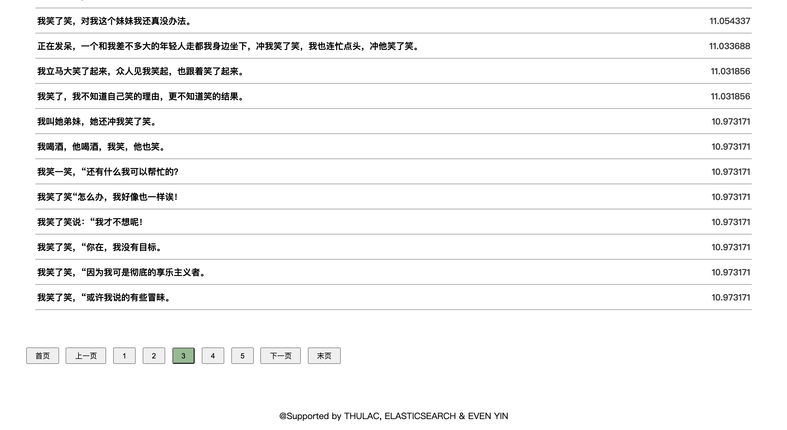
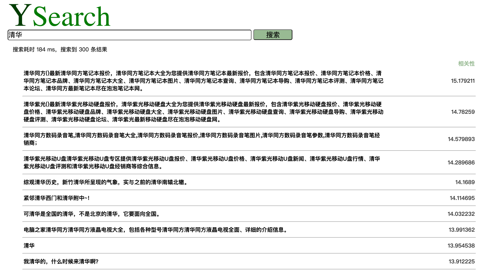
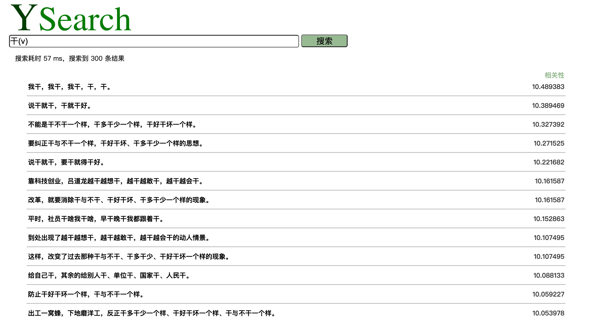
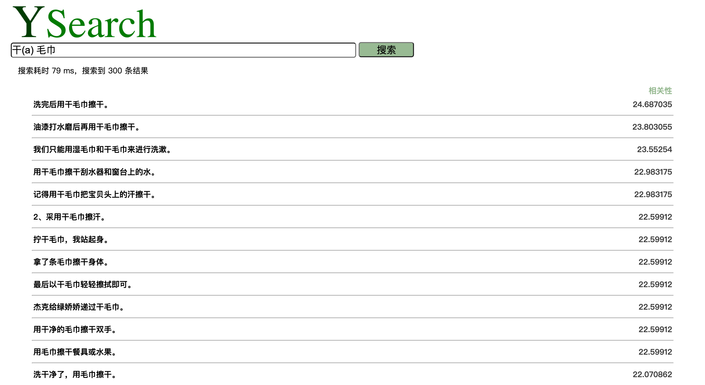
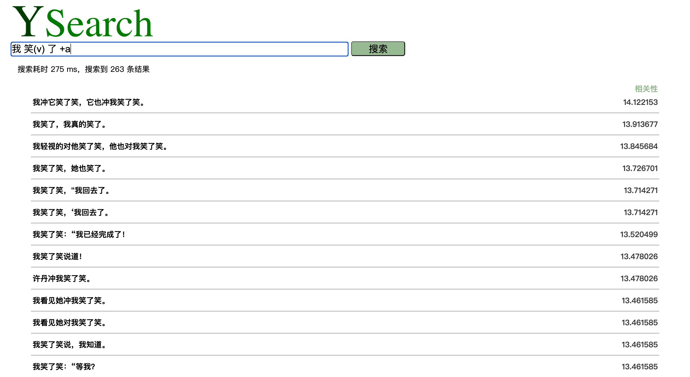
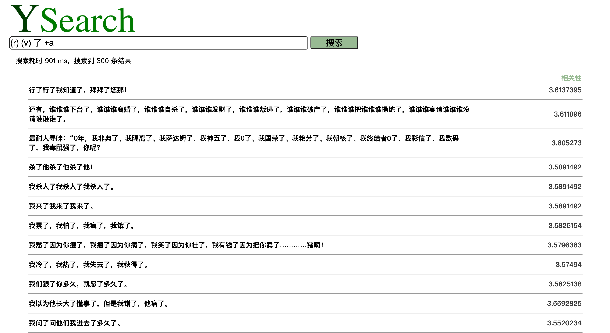

# YSearch信息检索系统

殷翊文 2017011485

## 1 分词与词性标注

选用thulac c++版本对数据进行分词和词性标注。使用人民日报数据和一份搜狗数据共39,024,052条，每条为一个句子。

+ 其中搜狗数据需要预处理，运行`./data/sogou.py`将原本的分词空格去除，并替换`<N>`为`0`。

+ 下载thulac c++版本，运行`./thulac -t2s -input [inputfile.txt] -output [outputfile.txt]`，对数据进行分词和词性标注。生成的文件为`sogou_output.txt`，`rmrb_output.txt`，格式为每行一句，每句以空格分词，每个词后接‘_'和相对应的词性。例如其中一行为：

  `我_r 不悦_a 地_u 道_v 。_w`

  

## 2 索引构建

在本地运行elastic search，端口9200，运行`./data/add2es.py`对分词结果进行处理，连接elastic search，并批量加入数据，由es生成索引。

es中index名称为”sentences“，每条数据对应一句话，由三个字段组成，分别对应词汇、词性、词汇加词性。例如其中一条数据如下：

```
{
  "content": "石头 与 石头 相击",
  "part": "n c n v",
  "mix": "石头_n 与_c 石头_n 相击_v"
}
```

由于数据已经分好词，es中三个字段的`analyzer`即分词器都设置为`whitespace`。


## 3 搜索实现

`./flask`文件夹下为基于flask的demo项目。在该文件夹下运行`python ysearch.py`，在浏览器中打开`http://localhost:5000/`即可。

### 3.1 Demo说明

Demo包含首页和搜索结果页两个页面，预览如下。




+ 点击YSearch图标可回到首页
+ 每页显示50条数据，支持分页功能
+ 最大搜索结果为300条
+ query格式错误会回到首页，并给出提示

### 3.2 搜索格式

支持的搜索格式：

+ `词汇1(词性1) 词汇2(词性2) ... 词汇n(词性n) [+a]`

+ `+a`为可选项，表示n个词必须按顺序相邻。

+ 如果没有相邻限制，那么n个词必须输入词汇，可以不限制词性；

+ 如果有相邻限制，那么不输入词汇，仅限制词性也是被允许的。特别地，仅搜索一串相邻的词性序列也是支持的，如下面的举例中第四条。

搜索举例：

+ `我 笑`
+ `我 笑(v)`
+ `我(r) (v) +a`
+ `(r) (v) (u) +a`

### 3.3 具体实现

查询使用python的`elasticsearch`库实现。

1. 无相邻条件的搜索：

   根据有无词性要求，分别在`content`和`mix`两个字段进行查询，使用es的bool查询，条件为should，即只要满足其中一个条件就好。

   例如query为“我 笑(v) 了”，那么查询的body为：

   ```
   body = {
     "from": from_,
     "size": size_,
     "query": {
     "bool": {
       "should": [{"match": { "content": "我 了"}},
       					 {"match": { "mix"    : "笑_v"}}]
       }
     }
   }
   ```

   from和size用来分页。搜索平均耗时在60ms左右。

2. 有相邻条件的搜索：

   首先按照无相邻条件的情况来搜索，es返回500条数据后，对数据进行筛选。筛选方法如下：

   + 对每个句子，首先定位query中的一个词，即找出所有可能的该词出现的位置。这个词选择的优先度为词汇+词性>词汇>词性，为了得到尽可能少的位置。
   + 对每个可能的位置，检查query中其它每个词汇或词性要求，是否符合相对位置，如果不符合则删去该位置。检查的优先度同上，为了快速过滤掉不可能的位置。
   + 如果最后不存在这样的位置，则过滤掉该条数据。

   最后返回符合要求的数据。搜索平均耗时在500ms左右。


## 四、问题与解决

1. Elastic search的写入问题。一开始为了测试，我在同一个程序里先写入再查询一批少量数据，结果发现查询结果为空。实际上数据库的写入也需要一点时间，两个进程是并行的，不能这么测试。写入后直接用postman查询即可。
2. 批量写入。我发现数据的写入非常慢，很少量的数据就需要耗费一秒的时间，所以必须用python elasticsearch库的helpers.bulk()，打包数据后批量写入。
3. 为了提高有词性限制的查找速度，我在数据库中新增了一个"mix"字段，同时记录词汇和词性信息，这样查找有词性限制的词汇时，只需要直接在该字段查找"词性_词汇"即可。
4. 相邻条件限制如果直接用es搜索，实现起来比较麻烦。由于数据要求量不大，在这里直接使用搜索后过滤的办法，对相邻词汇进行过滤。但这个算法的耗时较长。


## 五、demo演示

录屏见附件[screenrecord.mov][https://drive.google.com/file/d/1PbVAdU13siuza3AnmgpQo9TOy04tVlAB/view?usp=sharing]。

部分搜索结果截图如下：













