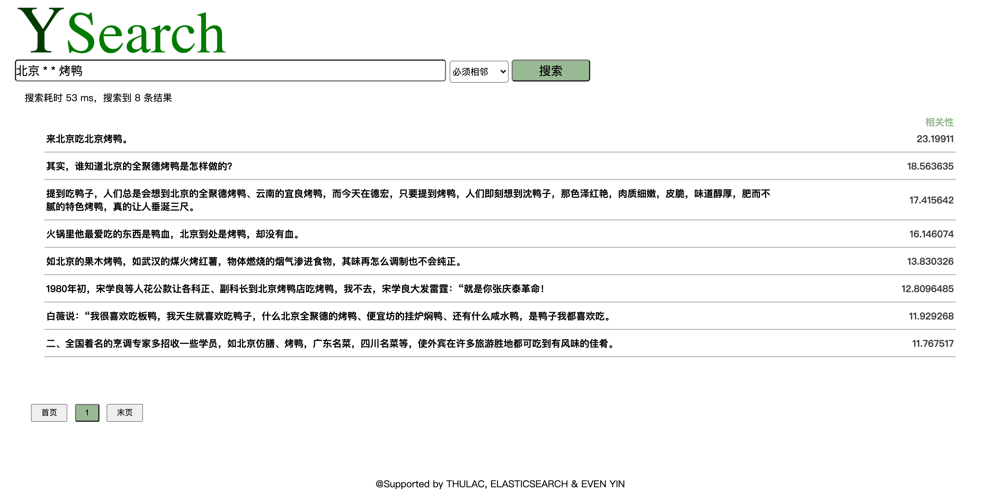
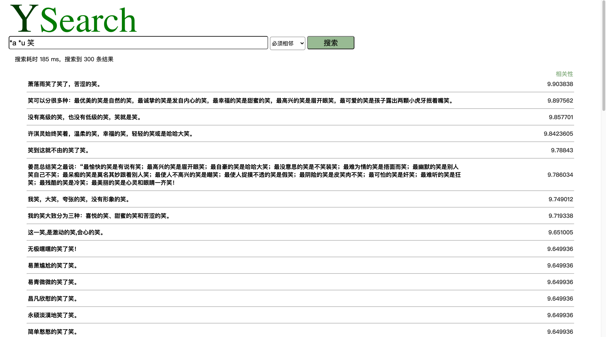
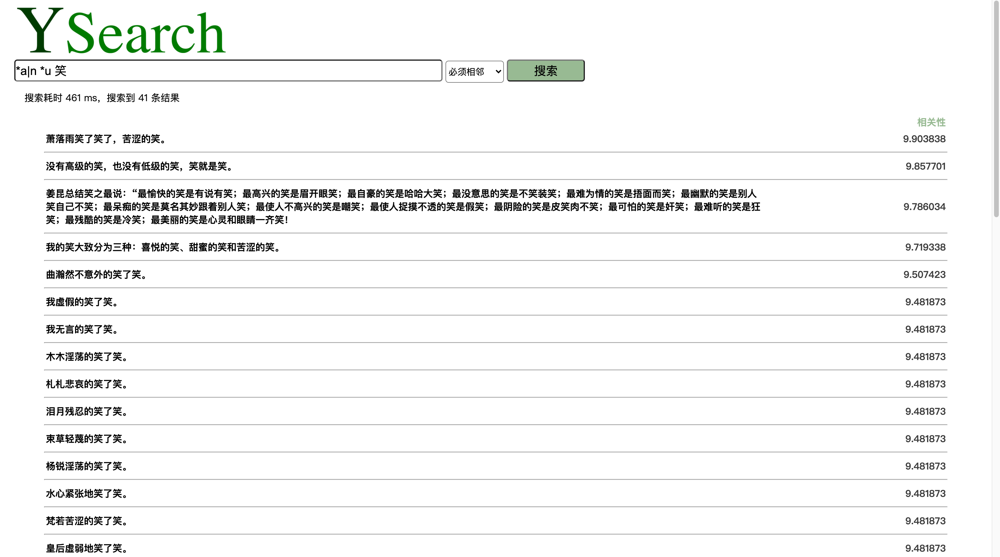
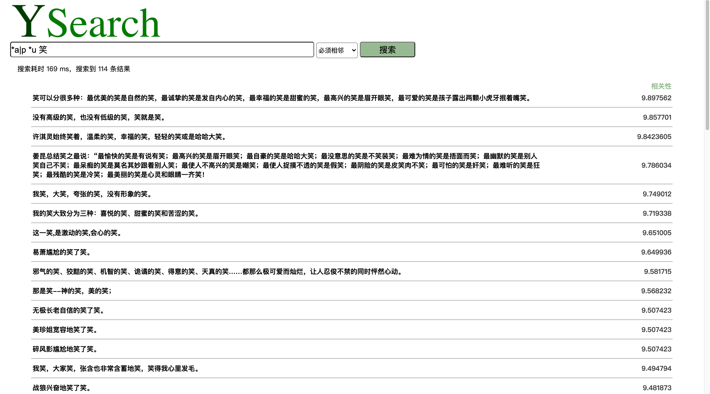
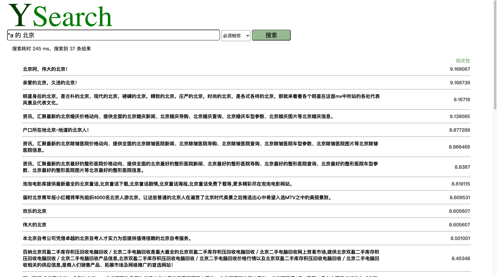
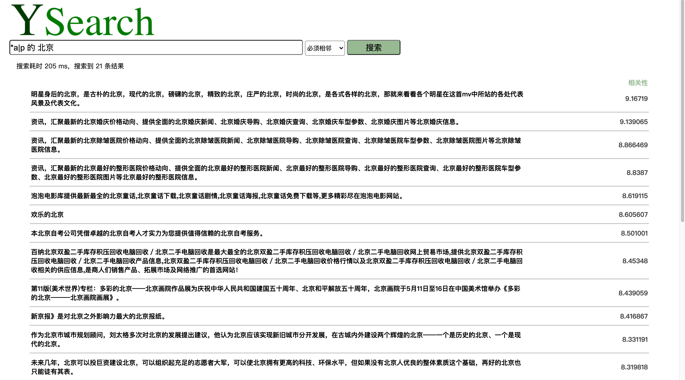
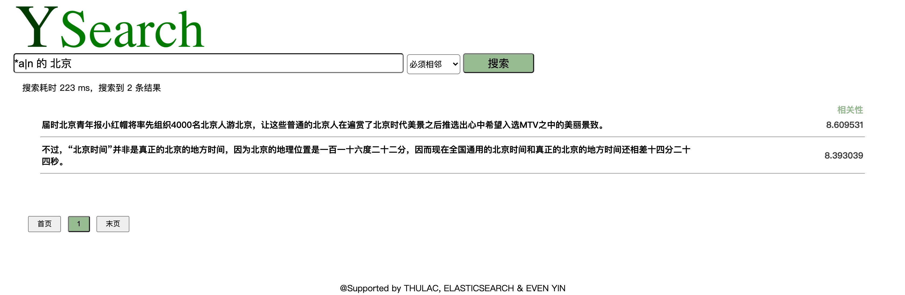

# YSearch信息检索系统 v2.0

殷翊文 2017011485

## 1 索引构建与运行方法

+ 使用人民日报数据和一份搜狗数据共39,024,052条，每条为一个句子。

+ 选用thulac c++版本对数据进行分词和词性标注，标注后的格式为每句一行，以空格分词，每个词后接‘_'和相对应的词性，如其中一行为：`石头_n 与_c 石头_n 相击_v`

+ 在本地运行elastic search，端口9200，运行`./data/add2es.py`对分词结果进行处理、连接elastic search并批量加入数据。每条数据对应一句话，由三个字段组成，分别对应词汇、词性、词汇加词性。例如其中一条数据如下：

  ```
  {
    "content": "石头 与 石头 相击",
    "part": "n c n v",
    "mix": "石头_n 与_c 石头_n 相击_v"
  }
  ```

+ `./flask`文件夹下为基于flask的demo项目。在该文件夹下运行`python ysearch.py`，在浏览器中打开`http://localhost:5000/`即可。


## 2 功能简介

### 支持的搜索格式

**一句话概括功能**：用`*`限定词性（词性可在首页查表），用`|`限定情感（n负向，p正向）。


分为两种搜索：

+ **不限**，即没有位置要求，仅基于关键词和词性要求的搜索。只要出现输入词中的一个及以上即可。

  **不限**模式下可以规定词的词性，允许的格式包括：

  + `词`
  + `词*词性`

+ **必须相邻**，即结果必须符合输入的位置顺序。输入的词（或要求）必须依次相邻出现在句子中。

  使用**必须相邻**模式，还可以限定词的情感，允许的格式包括：

  + `词`
  + `词*词性`
  + `*词性`
  + `*`（不限定词性，仅用于占位）
  + `*词性|情感`
  + `*|情感`（不限定词性，仅限定情感）


搜索举例：

+ 不限
  + `我 笑 了`
  + `我 笑*v 了`

+ 必须相邻
  + `开心 地 笑`
  + `开心*a 地 笑`
  + `* 地 笑`
  + `*a 地 笑`
  + `*a|p 地 笑`
  + `*|p 地 笑`


## 3 v2.0新增功能与实现

1. 增加了对词汇情感的分类，能够让用户搜索到一个词能够搭配哪些特定情感的词。最终效果很好（见4 效果演示），且搜索速度快，平均搜索总速度在200ms左右。

   具体实现如下：

   + 使用[Chinese Open Wordnet汉语开放词网](http://compling.hss.ntu.edu.sg/cow/)提供的中文WordNet，获取词汇对应的所有编号；
   
     ```python
     def load_net():
         lines = codecs.open("./app/static/cow-not-full.txt", "rb", "utf-8")
         net = dict()
         for line in lines:
             if line.startswith('#') or not line.strip():
                 continue
             splited = line.strip().split("\t")
             if len(splited) == 3:
                 (synset, lemma, status) = splited
             elif len(splited) == 2:
                 (synset, lemma) = splited
                 status = 'Y'
             if '+' in lemma:
                 lemma = lemma.split('+')[0]
             if status in ['Y', 'O']:
                 if not lemma.strip() in net.keys():
                     net[lemma.strip()] = [synset.strip()]
                 else:
                     net[lemma.strip()].append(synset.strip())
      return net
     ```

   + 使用nltk提供的wordnet和sentiwordnet库，获取所有编号对应的负向和正向情感值，取平均值；
   
     ```python
     def getSenti(word):
         # wordNet: dict{ word: [index, index, ...] }
         l = []
         if word in net.keys():
             l = net[word]
     
         if len(l) > 0:
             n = 0.0
             p = 0.0
             for index in l:
                 info = wn.synset_from_pos_and_offset(str(index[-1:]), int(index[:8]))
                 info = swn.senti_synset(info.name())
                 p += info.pos_score()
                 n += info.neg_score()
             return n / len(l), p / len(l) # average sentiment
         else:
          return 0, 0
     ```

   + 搜索过滤时，负向情感值>正向情感值的词判定为负向情感词，反之亦然，并根据用户要求进行过滤。

2. 修改了查询格式

   + 将手动输入"+a"改为选择标签限定“必须相邻”；且如果输入格式不符合”不限“的标准，可以自动判别为“必须相邻”。
   + 将词性限定的格式从`()`改为`*`，情感限定的格式设置成`|`。这是考虑到，用户在使用中文输入时，不用再频繁地切换中英文输入法来输入英文括号。`shift+8`和`shift+、`键可以直接输入`*`和`|`，而且如果使用搜狗拼音输入法，只需要再按一次shift就可以键入，不用在中英文输入之间来回切换。

3. 新增了占位查询，即`*`后不跟任何词性的查询，意在满足对>=1的位置距离的限定，如`北京 * * 烤鸭`可以查询到`北京的全聚德烤鸭`。而且，这种输入也更符合用户的认知习惯。


## 4 效果演示

### 占位搜索



### 情感搜索

+ 不使用情感搜索，只搜索”笑“能搭配哪些形容词和副词：



+ 用户想搜索”不好的笑“，即情感为负向的笑。可以看到结果有苦涩、低级、虚假、悲哀等等，效果很好。




+ 用户想搜索”好的笑“，即情感为正向的笑。可以看到结果有优美、自然、幸福、温柔等等。




+ 不使用情感搜索，只想搜索对北京的形容词



+ 用户想搜索对北京的正向的评价



+ 用户想搜索对北京的负向的评价，结果较少，”普通“和”通用“都被归在了负向情感的词汇集合里。

